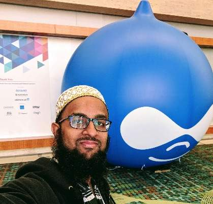

# Who is Hussain

*This is my personal README. My MANAGER readme is in a separate document for [quicker access](https://hussainweb.github.io/MANAGER-README/). As I am a person just like you (you're not a bot, right?), it would help to read this first before reading more about my management style.*

Hi, I am [**Hussain**](https://www.linkedin.com/in/hussainweb/), a [**Service Area Lead**](https://hussainweb.github.io/MANAGER-README/) at [Axelerant](https://www.axelerant.com/) who is learning the ropes of working more and more with people and teams rather than machines. I am an introvert pushing myself towards extroversion by speaking at conferences, organising meetups, and pushing myself to introduce myself to others at meetups and conferences. I have worked with a variety of technologies and spent a significant portion of my career on Drupal project and Drupal community along with the wider PHP ecosystem and technology in general.

I stress on learning fundamentals and theory but balanced with a healthy dose of pragmatism. I care about you as a person first and firmly believe that your well being comes before any work or cause. I try to be nice but not at the expense of being honest. I believe in giving feedback that needs to be heard rather than that which needs to be said. I think it is more important to be kind rather than being right. I describe more about [my management style in a different README](https://hussainweb.github.io/MANAGER-README/).

Thanks to my employer and the Drupal project, I travel quite a bit, which I love. I also enjoy trying out different cuisines, taking photographs of places, people, and food wherever I go, and writing about all of that, if possible. I [tweet a lot](https://twitter.com/hussainweb) and [Instagram a bit](https://www.instagram.com/hussain.web/). I am usually **hussainweb** online everywhere.

## A little bit more about me

### The little I know

I have built, and more importantly, helped others build several [Drupal solutions](https://www.drupal.org/u/hussainweb) over the past few years. While Drupal is the focus of my work now, I use or have used technologies across the spectrum of web development, developer tooling, and infrastructure management. For this, the most recent technologies I have worked with include Laravel, Symfony, React, Angular, Docker, Kubernetes, and others.

I have gathered various certifications over the years, including becoming an [Acquia-certified Grand Master](https://certification.acquia.com/registry/grand-masters?fname=Hussain&lname=Abbas&city=&state=&country=&org=&cred=All). My career has spanned from being a hobbyist and a freelancer to working in a large corporate to leading a small organisation. I have over ten years of industry experience and 20 years of programming experience. Over this time, I have worked with various technologies such as x86 assembly, HTML, CSS, JavaScript, VB6, C#, ASP.NET, PHP, Docker, and related frameworks and tools. These have included working in domains related to media and publishing, eCommerce, information services, enterprise technology, and more.

My current interests lie in Drupal, DevOps, and Machine Learning. In non-technology space, I am deeply interested in better people management, mentorship, community activities, and similar. My day work includes work in Drupal and DevOps spheres along with people management that is a part of my responsibilities. I try to keep up with machine learning through various learning channels such as podcasts, meetups, and various courses. I hope to use machine learning to solve problems very soon.

I am a responsible open source citizen and consciously design solutions beneficial not only to the product but also to the larger developer community. I believe that contributing to open source need not be an exhausting activity and have worked to ensure that at my workplace.

Over the years, I have also grown into a different and important role of mentoring my team and helping them achieve their goals. Through effective mentoring, I have helped transform people into high performing individuals who are happy with what they do. I firmly believe that a happy team is a productive team.

Most recently, I help my organisation by leading the Drupal Service Area. This is a new experience for me and I am hoping to learn deliver the best experience to my team and our customers. It is a multi-faceted role and I am hoping to do justice to my team.

I enjoy meetups, not just tech related, but anything that catches my interest. I frequent meetup groups related to DevOps, Machine Learning, Data Science, and more. I used to help organise [Drupal meetups](https://www.meetup.com/drupalbangalore/) and camps when I lived in Bangalore. I am hoping to do the same in the Greater Toronto region now. I am an avid listener of various podcasts and even co-hosted a podcast for a time.

### My pursuits

I love travelling and have been able to travel to various countries while attending and speaking at conferences. I have presented a talk at every DrupalCon and almost every DrupalCamp I have attended. I have also presented talks remotely to distributed audiences and at several meetups.

Apart from this, I do a bit of photography and cooking. I like trying out different restaurants and cafes and write about food, books, and movies. My love for travelling complements these pursuits perfectly. I am always on the lookout for a city's cuisine wherever I visit. Oh, and I love coffee and love trying coffees from different places, which is also something that goes perfectly with my travel. I write about this and more on my blogs infrequently and hope to do more.

## About this document

This document is my personal readme which describes a little bit about me, my values, and what you can expect when you talk to me. This document is inspired by [Matt Newkirk's article on sharing your manager readme](https://matthewnewkirk.com/2017/09/20/share-your-manager-readme/). I have extended the idea to be more holistic as a person rather than just a manager. If this idea helps or hampers the brevity of this readme (which IMHO is very important in communication) remains to be seen. Please share feedback by [tweeting at me](https://twitter.com/hussainweb).

## License

I am happy for my work to serve as an inspiration for your own READMEs, but since this content is about me, personally and professionally, I am licensing this work under a non free cultural license and restricting commercial usage.

 hussainweb's personal README is licensed under a <a rel="license" href="http://creativecommons.org/licenses/by-nc-sa/4.0/">Creative Commons Attribution-NonCommercial-ShareAlike 4.0 International License</a>.
